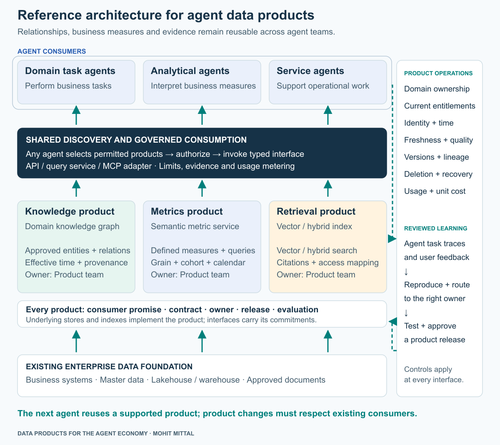
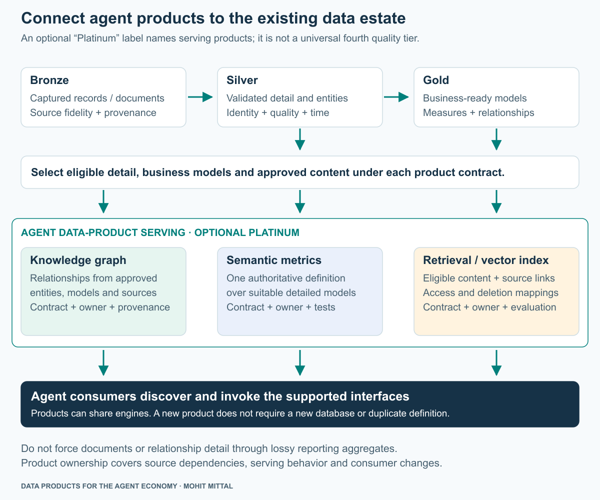
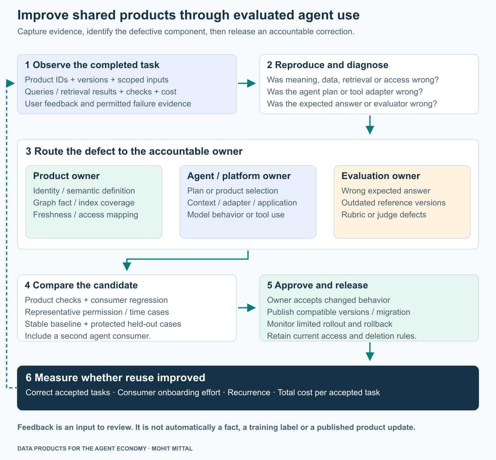
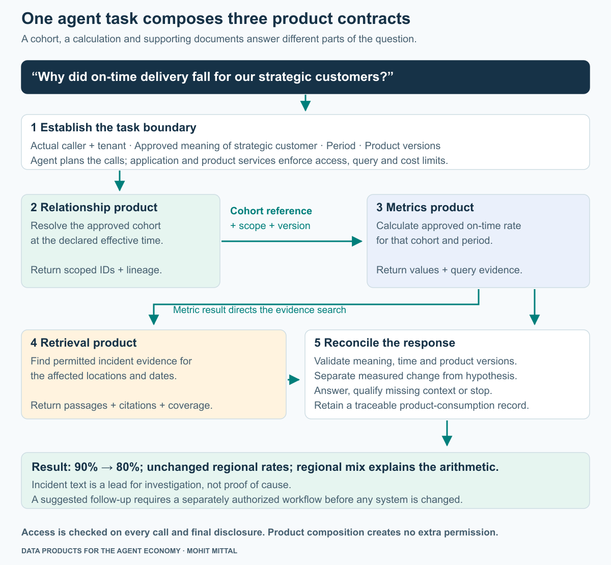

# Data Products for the Agent Economy

## How enterprises publish knowledge graphs, semantic metrics and retrieval indexes for agents to use

**Mohit Mittal · Independent architecture proposal · September 2026**

As an enterprise deploys agents across business functions, each team needs access to business entities and relationships, consistent measures and supporting evidence. If every team reconstructs that knowledge, writes its own metric queries and builds a private document index, the organization acquires many interpretations of the same business—and many copies to maintain.

**The enterprise should publish that knowledge as reusable data products that agents can discover and consume.** A knowledge graph supplies approved entities and relationships. A semantic metrics product supplies defined, executable business measures. A retrieval product supplies relevant, authorized evidence through a maintained vector or hybrid index. Each has a named owner, a supported interface and measurable commitments to its consumers.

This paper uses **agent economy** to describe an ecosystem in which agents across teams—and, where authorized, partner organizations—consume shared enterprise capabilities to perform work. The starting point is internal reuse. It does not require a commercial marketplace: the economic question is whether the next agent can use an existing product with less duplicated engineering and review effort.

The central architectural move is to make the products usable independently of the agent that first needed them. Their value comes from stable business meaning, controlled access and dependable operation across several consumers. The model and agent framework can change while the enterprise continues to own its definitions and evidence.

For a CIO, CTO or Chief Architect, three decisions follow:

- **What should become a product?** Identify recurring agent needs and publish the relationships, calculations or evidence that satisfy them.
- **What may an agent rely on?** Define each product's meaning, scope, access, freshness, failure behavior and evidence of correctness.
- **How will reuse improve?** Fund product ownership and use evaluated agent outcomes to repair shared products through reviewed releases.

The reference architecture comes first: product boundaries, consumption contracts, the data foundation, controls, evaluation and sourcing decisions. A separate worked example then shows a metric agent using the architecture. The final section explains how to adopt it.

## Reference architecture

Publish domain-owned knowledge, calculation and retrieval capabilities above the data estate. Expose them through governed interfaces, let agent applications select the products a task needs, and use evaluated outcomes to drive reviewed changes. These are logical responsibilities; they need not become separate platforms or teams.



*Figure 1. Reference architecture, independent of any single use case. Solid paths show publication and consumption routes; a task selects the products it needs. Dashed paths carry observations from the consumer group to owner review and reviewed releases back to the products. Column alignment does not assign an agent to a particular product. Product and application interfaces enforce the relevant controls.*

| Architectural responsibility | What it owns |
|---|---|
| Enterprise data foundation | Authoritative inputs, validated transformations and source access |
| Domain data products | Business meaning, supported operations, quality and lifecycle commitments |
| Discovery and consumption | Product selection, version resolution, verified identity, bounded invocation and usage records |
| Agent applications | Task intent, product composition, result acceptance, final disclosure and separately authorized actions |
| Product operations and learning | Consumer support, evaluation, incident diagnosis and reviewed releases |


**Reading guide:** [Reference architecture](#reference-architecture) · [Product promises](#1-publish-three-distinct-product-promises) · [Consumption contracts](#2-design-the-contract-for-agent-consumption) · [Data foundation](#3-build-on-the-data-estate-you-already-operate) · [Failure and access](#4-make-failure-and-access-part-of-the-product) · [Evaluation and learning](#5-make-agent-use-improve-the-products) · [Build vs. Buy](#6-build-vs-buy-buy-engines-own-the-product) · [Worked example](#7-worked-example-one-metric-agent-three-products) · [Adoption](#8-adopt-through-a-second-consumer)

## 1. Publish three distinct product promises

The unit of reuse is a business capability with an operating commitment. A team consuming a knowledge product needs to know which relationships it can rely on, at what effective date and under whose authority. Knowing which graph database stores the nodes is secondary.

Domain ownership, data as a product and shared platform services provide a useful foundation. The particular architecture here applies those principles to agent consumption: products must make their meaning and permitted use explicit enough for an application to select and invoke them reliably. [Zhamak Dehghani, *Data Mesh Principles and Logical Architecture*](https://martinfowler.com/articles/data-mesh-principles.html).

### Knowledge products: entities and relationships

**Consumer promise:** resolve permitted business entities and approved relationships for a declared effective date.

The domain owner defines entity types, relationship meaning and authoritative sources. A product team maintains identifiers, relationship provenance, source mappings and the serving interface. Commercial ownership, contractual entitlement and operational dependency are different relationships; a shared graph must preserve their meaning and permitted uses.

Publish bounded entity-resolution, relationship-traversal and evidence operations, with domain-specific names and schemas. Inputs specify known identifiers, relationship types and an effective date. Responses carry stable entity IDs, relevant relationship paths, validity periods, source references, product versions and any unresolved mappings. A consequential uncertain identity match needs resolution; it cannot silently become an approved merge.

The graph is the maintained representation of business relationships. Extracted document statements remain provisional until they meet the product's acceptance policy. A domain graph and a lineage graph also have different jobs: the former connects business entities; the latter connects data assets, transformations and consumers. Link them through controlled identifiers. Neither automatically establishes the completeness or truth of the other. [W3C provenance model](https://www.w3.org/TR/prov-dm/).

An organization with a simple, stable hierarchy can begin with a relational implementation behind the same product contract. Invest in a graph engine when representative traversal, changing relationships and explanatory paths justify its operating cost. The data product persists even if its storage implementation changes.

### Semantic metrics products: executable business meaning

**Consumer promise:** calculate approved measures for a specified population, period and breakdown.

Publish metric definitions together with an execution service. The contract establishes business grain—what one counted or aggregated record represents—plus numerator and denominator, supported dimensions, permissible joins, calendar, exclusions, correction policy and owner. Agents invoke an approved calculation; each application should not generate its own interpretation of a business measure from table descriptions.

`query_metric` accepts a released metric ID, definition version, a compatible reference to the selected business population (or cohort), periods and permitted dimensions. Its result includes the value, component measures, units, scope, actual time bounds, source snapshot or coverage watermark, quality status and calculation reference. Distinct business definitions receive explicit names or versions. Finance's recognized revenue and Sales' bookings should not be collapsed into a single ambiguous “revenue” measure.

Executable semantics matter. Averaging percentages without denominator weights, multiplying rows through a one-to-many join, or using a current hierarchy to restate historical results can produce plausible but incorrect answers. Product tests must reconcile these cases. A semantic model's declared cardinality is a constraint to validate against real data. [dbt join logic](https://docs.getdbt.com/docs/build/join-logic).

There are concrete mechanisms to expose such products to agents. dbt's MCP tools include metric discovery, dimension discovery and metric queries. They provide an access path to defined measures; the enterprise remains responsible for the definitions, permitted tool subset and underlying data. Availability depends on the relevant service and plan. [dbt available MCP tools](https://docs.getdbt.com/docs/dbt-ai/mcp-available-tools).

### Retrieval products: governed access to evidence

**Consumer promise:** return relevant, permitted passages from a declared corpus, with enough provenance to inspect their meaning and applicability.

A reusable vector index becomes a product when someone owns the eligible sources, extraction quality, chunking, embedding configuration, refresh, entitlement mapping, deletion, retrieval evaluation and consumer interface. A product entry might publish the index directly to approved clients or expose it through `search_evidence`. A service interface gives the producer more control over query limits and enforcement while insulating consumers from index changes.

Return source IDs and versions, document locations, event or validity dates, retrieved passages and index/retrieval versions. Preserve links to the authoritative record. Similarity scores describe retrieval behavior; they are not probabilities that a statement is true. Empty results do not establish that the underlying fact or event does not exist.

Use lexical matching for exact identifiers and domain terms alongside vector retrieval where it improves representative tasks. Graph traversal can expand a search through known relationships when that helps. These are selectable retrieval strategies, not a requirement that every query traverse a graph and a vector index. [Neo4j retrieval guide](https://neo4j.com/docs/neo4j-graphrag-python/current/user_guide_rag.html).

The three products can have different owners and release cadences while sharing infrastructure. They can also be interfaces of one cohesive domain product when purpose, ownership and lifecycle align. Do not split them into separate organizations solely because their storage technologies differ.

McKinsey's public AI data-readiness guidance describes curated unstructured data products exposed through search and APIs, with relationships preserved as information is transformed. That supports this serving direction; the three-product contract and operating model here are an independent proposal. [McKinsey, *AI data readiness*](https://www.mckinsey.com/capabilities/mckinsey-technology/our-insights/ai-data-readiness-the-key-to-scaling-impact).

## 2. Design the contract for agent consumption

An enterprise catalog must help a team select the correct product before runtime and help an authorized application resolve supported operations at runtime. A registry of endpoint names is insufficient. Publish business purpose, supported questions, definitions, owner, evidence of qualification, access route, supported versions, service objectives, cost model and deprecation policy. Restrict catalog metadata itself where even discovering an asset would disclose sensitive information.

Start from a consumer's task, then test the product boundary against another consumer. This follows the consumer-first discipline in Kiran Prakash's *Designing data products*. The additional requirement here is that the contract also support bounded machine invocation. [Designing data products](https://martinfowler.com/articles/designing-data-products.html).

### The contract has four parts

| Part | What the producer publishes | What the consumer can check |
|---|---|---|
| Business promise | Meaning, permitted uses, identity namespace, grain, effective-time and correction rules | Whether this product can answer the intended question |
| Invocation | Typed inputs/outputs, supported operations, identity delegation, query limits and error behavior | Whether the call is authorized, well formed and within budget |
| Evidence and service | Provenance, version/coverage metadata, evaluation cases, freshness/availability objectives and support | Whether this result meets the task's acceptance conditions |
| Change and retirement | Compatible versions, migration path, consumer inventory, retention and deletion obligations | Whether a release, source correction or retirement affects the application |

The Open Data Contract Standard supplies useful vocabulary for schema, roles, quality and service commitments. Agent-facing operation descriptions and composition rules may require additional fields. A schema-conforming file is only the specification; running checks and operating procedures establish whether it is being met. [ODCS](https://bitol-io.github.io/open-data-contract-standard/latest/).

The following is a **proposed response shape**, not a vendor standard. It makes result types and evidence visible to application checks:

```text
result_type: metric_result | relationship_result | evidence_passages
product: product_id, contract_version, implementation_release
request: request_id, task_id, authorized_scope_reference
result: typed product-specific payload
coverage: effective_period, data_snapshot_or_watermark, completeness_status
evidence: source_references, calculation_or_retrieval_reference
execution: outcome, policy_decision_reference, elapsed_ms, metered_usage
```

The service derives actual identity and scope from verified credentials and policy; an agent-supplied identity field cannot authorize access. A policy reference records a decision, not a reusable grant. Keep sensitive details in protected records and return only references the caller may see. Distinguish contract version, implementation release, data snapshot and current policy: none can stand in for the others.

### Discovery, selection and invocation are separate decisions

An application resolves approved products, checks the supported operation and version, obtains the required scoped credentials, then invokes the interface. The product validates the request and enforces access and resource limits. The consuming application checks response types, required evidence and compatibility before using a result in an answer. Current authorization also constrains final disclosure and any downstream handoff.

An API, query service or MCP adapter can expose this interface. MCP supplies tool listing, typed invocation and optional output schemas; server implementations still own validation, access control and rate limits. It does not certify a product's business meaning or provide an enterprise approval process. [MCP tools specification](https://modelcontextprotocol.io/specification/2025-11-25/server/tools).

Keep broad development tools separate from a certified product interface. If a metrics product promises approved calculations but also offers unrestricted SQL on the same consumption path, an agent can bypass that promise. Snowflake's managed MCP documentation explicitly identifies this risk when direct SQL tools accompany business-agent tools. It also distinguishes permission to discover an MCP server from privileges on its underlying tools. [Snowflake managed MCP server](https://docs.snowflake.com/en/user-guide/snowflake-cortex/cortex-agents-mcp).

For partner agents, add explicit agreements on identity federation, purpose, onward disclosure, residency, liability for corrections, support and commercial terms. Begin with a deliberately small product surface. An internal product does not become externally shareable simply because its endpoint speaks a common protocol.

### Composition is an application responsibility

Individually valid products do not automatically form a valid answer. The consuming application checks three conditions before combining results:

1. **Population and identity:** requested and applied populations match, entity namespaces are compatible, and permissions have not silently reduced a claimed complete population. A narrower answer requires an explicitly supported scope and label.
2. **Time and correction basis:** definitions, effective periods and data versions support the requested comparison. Use reproducible snapshots or retained calculation references where the contract promises reproducibility; a freshness watermark alone is insufficient. Current access still applies.
3. **Evidence applicability:** retrieved sources identify their versions, coverage and relevant entities or period. Their relevance cannot override a failed calculation or scope check, and retrieval scores do not establish causation.

Required checks fail closed for the affected conclusion. Optional evidence can be unavailable without invalidating independently verified results, provided the application clearly qualifies what remains unanswered.

## 3. Build on the data estate you already operate

The products need authoritative inputs and dependable transformation paths. Existing operational systems, master data, lakehouses, warehouses and document repositories remain their foundations. The incremental investment is the product boundary: curated meaning, serving interface, evaluation, consumer support and lifecycle operation.

In a medallion estate, Bronze preserves captured inputs, Silver supplies validated detail and identities, and Gold supplies business-ready models and measures. An optional **Platinum** label can name the semantic and knowledge products served to agents. The cited Microsoft and Databricks references define three medallion layers; Platinum is a proposed local extension, not an established fourth quality grade. [Microsoft medallion guidance](https://learn.microsoft.com/en-us/fabric/onelake/onelake-medallion-lakehouse-architecture), [Databricks medallion guidance](https://docs.databricks.com/aws/en/lakehouse/medallion).



*Figure 2. Product serving builds on the existing foundation. A graph may need validated entity detail; retrieval needs eligible content; metrics need models at the correct grain. Every product owns its relevant dependencies across layers.*

Keep one authoritative metric definition. Gold already contains business meaning; Platinum need not recreate it or materialize another copy. Documents need not pass through a reporting aggregate before indexing. A logical product can share an engine with other products, while a derived store needs its own synchronization, access and recovery commitments.

Existing catalogs, lineage and metadata automation can support discovery and impact assessment. Their coverage must be measured. They cannot establish an unrecorded business relationship, settle a disputed measure or identify an undocumented agent consumer automatically. Keep the investment tied to the selected agent task and the products it needs.

## 4. Make failure and access part of the product

Agent consumption increases the cost of a vague interface. A human analyst may notice a stale cohort or question an empty result; an application may continue unless the contract tells it to stop. Publish failure semantics that the consuming application can enforce.

| Condition | Required product/application behavior |
|---|---|
| Ambiguous identity or metric | Request clarification or stop the affected conclusion; do not choose a materially different meaning silently |
| Required data incomplete or stale | Return a machine-readable condition; serve a permitted labeled snapshot only if the task allows it |
| Optional product unavailable | Preserve independently verified results and qualify the missing contribution; do not invent an answer |
| Access denied or restricted discovery | Enforce the boundary without leaking protected asset existence; internal diagnosis can be more specific than the consumer response |
| Cross-product versions or time bases incompatible | Reject the combination or use an explicitly supported compatible set |
| Source deletion or entitlement revocation | Prevent prohibited serving promptly, propagate deletion through derivatives and caches, and retain auditable handling under policy |

**Test the effective serving permissions, not just source-table permissions.** Snowflake documents Cortex Search queries as executing with the service owner's rights: an authorized service caller may access indexed content even without privileges on its source tables. A safe design must therefore evaluate the actual service boundary, partitions and enforced filters. A filter chosen by the agent is not an authorization control. [Cortex Search access behavior](https://docs.snowflake.com/en/user-guide/snowflake-cortex/cortex-search/query-cortex-search-service).

The same scrutiny applies to graph traversal, metric aggregates, cached answers and traces. Combining individually permitted results can reveal a protected relationship or a small population. Enforce applicable purpose, aggregation and disclosure rules in services and the consuming application. Prompt instructions alone cannot implement these controls.

Products held in different stores are rarely refreshed in one coordinated update. A metric snapshot may be newer than a relationship graph or document index. Publish coverage and effective-time metadata, and let the task choose between a compatible historical set, an explicitly qualified answer or a stop. Current access and deletion rules still apply when replaying old data. Rolling back a release must not restore revoked access.

Treat retrieved text as evidence, including when it contains instructions. Keep credentials, tool selection limits and execution rights outside its authority. OWASP identifies indirect prompt injection through externally supplied content; retrieval does not remove that threat. [OWASP prompt injection](https://genai.owasp.org/llmrisk/llm01-prompt-injection/).

A data product authorizes a read or calculation within its contract. If an agent proposes updating an account, reallocating an order or opening a case, the operational service needs a separate action contract, validation and authorization. An analytical result is not a grant to act.

## 5. Make agent use improve the products

A poor agent answer can reveal a product defect. It can also reveal an incorrect plan, a bad tool adapter or a faulty evaluation reference. Diagnose the failure before choosing the remedy. This is where evaluation becomes partly a data-product responsibility: the enterprise must maintain the facts, definitions, temporal references and expected behavior used to judge an answer.

Fitness is specific to the supported use and must be rechecked as inputs and consumers change. Gartner's public AI-ready-data guidance emphasizes continuing qualification rather than a one-time preparation exercise. A product approved for account summaries has not thereby been qualified for payment decisions. [Gartner, *What Is AI-Ready Data?*](https://www.gartner.com/en/articles/ai-ready-data).

| Observed failure | Diagnostic question | Likely repair owner |
|---|---|---|
| Wrong entity population | Was the hierarchy incorrect, the date wrong, or the agent's cohort selection wrong? | Relationship product or agent/application owner, after reproduction |
| Incorrect percentage | Did the metric definition, source completeness, join, query or displayed answer fail? | Metrics product or application owner |
| Unsupported explanation | Was relevant evidence absent, inaccessible, poorly retrieved or misinterpreted? | Retrieval product or application/model owner |
| “Failed” evaluation of a correct answer | Does the expected answer refer to a different snapshot, definition or access scope? | Evaluation owner |
| Information disclosed outside scope | Which serving, caching, handoff or presentation boundary failed? | Product/platform and consuming-application owners |

An evaluator that expects a restated value can incorrectly fail an answer based on the requested historical snapshot. Pin the expected definition and data state; “the latest answer” is not a complete reference. Similarly, access-limited retrieval should not be judged against documents the caller could never receive.

### Evaluate the product and the composed task

| Evaluation level | Representative checks |
|---|---|
| Knowledge product | Identity matches, approved relationship types, historical validity, missing mappings, conflicting assertions and permitted traversal |
| Metrics product | Numerator/denominator, grain, join cardinality, aggregation, time, source completeness and access scope |
| Retrieval product | Relevant-evidence recall on reviewed cases, ranking quality, citations, supersession, permission isolation and deletion visibility |
| Composed agent task | Correct product selection, compatible scope/time, supported conclusion, appropriate clarification, tool limits and total human review effort |

Maintain an owned evaluation dataset with provenance, versioned cases, expected results or rubrics, and separate development and held-out cases. An LLM judge can assist with relevance or explanation quality when calibrated against reviewed examples. Independently executable checks must establish arithmetic and critical permission conditions. A persuasive explanation is not evidence that these checks passed.

Databricks documents managed evaluation datasets and distinguishes feedback on observed outputs from expectations of desired behavior. Those mechanisms support the workflow; owners still need to retain the external source, product, permission and application versions necessary to interpret a run. [MLflow evaluation datasets](https://docs.databricks.com/aws/en/mlflow3/genai/eval-monitor/build-eval-dataset), [Human feedback and expectations](https://docs.databricks.com/aws/en/mlflow3/genai/human-feedback).



*Figure 3. Evaluation can change a shared product, the consuming agent or the evaluator itself. Feedback is a candidate signal. Owners approve tested changes before other agents receive them.*

Keep decision traces as observable records: task and product references, selected operations, source versions, concise decision rationale, checks, outcome and metered consumption. Protect sensitive payloads and apply retention policy. Hidden model reasoning is neither required nor an audit contract.

A failed case should become a reviewed regression case when it represents supported use. Compare the repair against a stable baseline and protected held-out cases, including another consumer. A metric correction may repair five agents at once; an incompatible change can also break five at once. Use consumer-impact checks, versioned release and rollback. Train or fine-tune a model only when diagnosis and evaluation justify that remedy; a source-policy error needs a source-policy repair.

The useful feedback loop is therefore **agent task → evidence → diagnosis → owner repair → evaluation → compatible release → observed result**. Never promote generated graph relationships, inferred metric definitions or retrieved claims automatically into authoritative products.

### People and decision rights

| Accountable role | Decisions and recurring work |
|---|---|
| Domain product owner | Consumer promise, authoritative meaning, source responsibilities, acceptable use and compatibility of changes |
| Data-product engineering team | Publication pipeline, interfaces, evaluations, source incidents, recovery, support and retirement |
| Shared platform owner | Common discovery, identity integration, contract tooling, observability, metering and paved deployment paths |
| Agent/application owner | Task success, product selection, safe composition, final disclosure, human review and separately authorized actions |
| Business sponsor | Funded use case, accepted outcome, value measurement and expansion or retirement decision |

Security, privacy and domain specialists contribute concrete acceptance conditions within these responsibilities. A cross-functional review should settle decisions that require it; it should not become a separate ticket for every ordinary read. Staff the support and stewardship work as part of the product budget, not as an informal favor from the original agent team.

## 6. Build vs. Buy: buy engines, own the product

The procurement question is which existing capabilities can satisfy the product promise and which missing interfaces justify custom work. Reuse is an option within that decision. Tool combinations below are candidates, not a tested integrated stack.

| Capability | Buy or reuse candidates | Enterprise work to own or build |
|---|---|---|
| Semantic metrics | Existing governed BI/semantic services; dbt Semantic Layer; Snowflake semantic views; Databricks metric views | Definitions, identities, calendars, validated joins, supported query surface and independent reconciliation |
| Knowledge graph | Existing MDM and relationship services; relational hierarchy; graph engine such as Neo4j when justified | Domain ontology, authority for facts, temporal mappings, bounded operations and correction workflow |
| Retrieval / vector index | Existing search platform; pgvector, Neo4j retrieval, Snowflake Cortex Search or Databricks AI Search as appropriate | Corpus and source rights, entitlement enforcement, extraction/chunking, relevance evaluation, deletion and citations |
| Discovery and agent access | Enterprise catalog, identity gateway, APIs and supported MCP adapters | Product selection policy, typed contracts, allowed tools, identity delegation, cost limits and consumer records |
| Evaluation and operation | Existing CI, observability and MLflow or comparable evaluation tooling | Domain cases, trusted expected results, product-versus-agent diagnosis, acceptance and incident ownership |

Product documentation illustrates feasible mechanisms: Databricks metric views model measures and dimensions; Snowflake semantic views encode governed business semantics; Neo4j's MCP adapter exposes database tools. A general read-query tool is broader than a bounded domain operation. Inspect the tool inventory and deploy only the consumer capabilities intended by the contract. [Databricks metric modeling](https://docs.databricks.com/aws/en/uc-semantics/metric-views/basic-modeling), [Snowflake semantic-view development](https://docs.snowflake.com/en/user-guide/views-semantic/best-practices-dev), [Neo4j MCP tools](https://neo4j.com/docs/mcp/current/tools/).

Databricks managed MCP servers expose scoped Genie Agents, AI Search indexes and Unity Catalog functions, among other endpoints; the documented capability is Public Preview at this review. It does not establish a dedicated metric-view MCP endpoint or remove per-service cost and permission design. Recheck availability and behavior for the proposed deployment. [Databricks managed MCP](https://docs.databricks.com/aws/en/agents/mcp-tools/managed-mcp).

Evaluate vendors against a product acceptance suite: the same business questions, identities, access scopes, changed definitions, late data, deletions, load and failure conditions. Include exportability of contracts and evaluation assets. The enterprise should be able to change a model, adapter or engine without losing ownership of its business semantics.

## 7. Worked example: one metric agent, three products

An operations leader asks a metric agent: **“Why did on-time delivery fall for our strategic customers between July and August?”** The following example is synthetic. It illustrates the products' contributions and the limits of the resulting explanation. The reference architecture is instantiated as three named products: **Customer Relationship Graph**, **Delivery Metrics** and **Operations Evidence**. Their implementation and operating commitments are specific to this scenario.

First, the application establishes the approved measure and reporting basis. Customer Relationship Graph resolves the strategic-customer cohort as of July 1. The agent uses that fixed cohort for both months; unknown membership blocks a complete comparison. Changing the membership between months would answer a different question.

Delivery Metrics calculates an order-level rate. The denominator includes eligible orders due in the month, including undelivered orders, and excludes orders canceled before the first committed deadline. The numerator counts orders fully delivered by that deadline. Reporting uses the original destination timezone, the region recorded at commitment and monthly snapshots frozen seven days after month-end. These are proposed choices for the example, not universal definitions.

| Region | July: on time / due | August: on time / due | Rate in each month |
|---|---:|---:|---:|
| North | 76 / 80 | 38 / 40 | 95% |
| South | 14 / 20 | 42 / 60 | 70% |
| Total | 90 / 100 | 80 / 100 | 90% → 80% |

South's share increases from 20% to 60%. Recomputing August with July's regional weights gives 90%. In this complete two-region decomposition, the changed mix accounts for the full ten-percentage-point aggregate decline; neither regional rate deteriorated. That establishes the arithmetic contribution, not why the mix changed.

The agent then queries Operations Evidence for the relevant regions and period. Suppose a synthetic August note reports a sorting backlog. The note is an investigation lead. It does not prove that the backlog caused the aggregate decline or the shift in order mix. The answer should explain what the calculation establishes and what further investigation remains.



*Figure 4. The graph supplies the population, the metrics service supplies the calculation, and retrieval supplies documentary evidence. These dependencies are selected for this task. Other agents can reuse one or two products without executing this entire sequence.*

If documentary retrieval times out, the application can return the verified numbers while identifying the incomplete investigation. If the denominator is uncertified, it stops the numerical conclusion. If customer IDs or effective periods are incompatible, a successful response from each service still does not justify combining them. Products therefore need both independent tests and composition tests.

### What the application checks before combining results

The following **filled synthetic consumption record** illustrates the checks. The identifiers are proposed references, not outputs from the runnable arithmetic fixture. Full membership and policy records are protected; references reveal only what the caller may inspect.

| Product response | Relevant recorded state |
|---|---|
| Customer Relationship Graph | Cohort `strategic-jul01-r1`; namespace `enterprise.customer.v1`; membership effective 2026-07-01; immutable graph snapshot `g042`; no unresolved members; membership interpretation frozen for both periods |
| Delivery Metrics | Definition `on-time-order.v1`; requested and applied cohort both `strategic-jul01-r1`; complete cohort coverage under the metric service's current permissions; immutable data snapshots `july-frozen-r1` and `august-frozen-r1`; calculation reference `calc-017` records the definition, inputs and grouping |
| Operations Evidence | Approved corpus `ops-incidents.v1`; declared search period July–August 2026; index release `idx-028`; searchable-source manifest `docs-028` identifies source versions and ingestion coverage; returned passages retain their source event dates |

The application applies the reference architecture's composition checks to this record:

1. **Population:** require `strategic-jul01-r1` in `enterprise.customer.v1`, with complete coverage of that cohort under current permissions. A restricted subset cannot be presented as the complete comparison.
2. **Time:** require `on-time-order.v1`, the July/August frozen snapshots and the July 1 membership basis. Retain `calc-017` so the reported values can be tied to those inputs.
3. **Evidence:** require the approved `ops-incidents.v1` corpus, source versions from `docs-028` and passages applicable to the selected entities and period. Coverage limits qualify the investigation, and a matching note cannot establish the cause of the calculated change.

For example, a metric result marked `applied_cohort=strategic-current-r2` is rejected for this comparison even if its percentage looks plausible. A record containing `august-restated-r2` is not accepted as the requested frozen August result without an explicitly changed reporting basis. Each product may be valid independently; the combination fails this task's contract.

An account-review agent can consume the same products for one permitted commercial group. A service agent can reuse identity and incident retrieval without querying the metric. This is the adoption test: the second application gets a supported capability, not another copy of an index, prompt or formula.

### Reuse beyond the metric agent

| Agent consumer | Relationship product | Metrics product | Retrieval product |
|---|---|---|---|
| Account-review agent | Resolve the permitted commercial group | Calculate its delivery trend | Retrieve relevant account and incident evidence |
| Metric agent | Fix the population for a comparison | Calculate and decompose the change | Find material for further investigation |
| Service agent | Resolve account and contract coverage | Use only if the case needs a measure | Retrieve applicable procedures and case evidence |

*Illustrative consumer map. Each product enforces the caller's scope; sharing a product does not mean every agent receives the same data.*

The scenario has a warehouse, customer master, approved KPI reports, an identity service and an incident repository. The incremental work is the shared product contract, temporal relationships, approved metric interface, retrieval qualification and acceptance suite. The products reuse that foundation.

[Run the synthetic arithmetic example](example/README.md). Its 17 checks cover selected calculation and contract failures. It does not implement the product services, graph, retrieval, permission system or complete agent workflow.

## 8. Adopt through a second consumer

Start with one consequential agent task and an inventory of existing data capabilities. Identify which required meanings and operations are already governed and which product commitments are missing. Fund that gap, including interfaces, qualification and continuing ownership; retain useful warehouse, master-data, reporting, identity and search investments.

Do not build all three products merely to complete the diagram. If the first task needs only a measure, begin there. Select a second consumer early enough to test whether the interface and ownership really support reuse. The first useful milestone is an additional agent adopting the capability without copying its business logic or taking over its source pipelines.

The second consumer can change that commitment. A second consuming team may require fresher information or longer historical support than the first one funded. The product owner assesses and negotiates the supported requirement; the sponsor funds any expanded service obligation and resolves priority conflicts. Consumer owners maintain acceptance cases and complete agreed migrations. The requirement either fits the current contract, justifies a funded extension or remains outside the promise. Adoption must not silently create an unfunded service-level commitment.

### Adoption gates and the evidence they require

| Gate | Evidence before advancing |
|---|---|
| Select the first product | Named task and owner; recurring need; source rights; agreed meaning; baseline task effort and quality |
| Qualify the interface | Correctness and permission tests; known failure behavior; supported versions; freshness/coverage checks; operating owner and recovery path |
| Run the first consumer | Limited release; traceable answers; measured total effort; handled exceptions; incident and correction process exercised |
| Onboard a second consumer | Independent team uses the same contract under its own scope; compatibility tests pass; integration and support effort are measured |
| Expand or retire | Comparison under equivalent quality and control requirements supports expansion after accounting for migration, parallel operation and recurring costs; demand warrants ownership; reconciled duplicate assets have credible retirement plans |

No fixed date proves readiness. Where existing agents already use private assets, register their consumers and meanings first. Reconcile differences with the proposed product, run representative comparisons, then migrate one consumer at a time. Keep a temporary rollback path and explicit retirement conditions. Replacing an old calculation may intentionally change answers; document the reason rather than forcing parity with a known defect.

Before funding expansion, compare three ways to deliver the same supported task: **extend an existing governed service, retain separate data capabilities within each application, or publish the shared product**. Include incremental engineering, meaning reconciliation, access work, migration, temporary parallel operation, ongoing stewardship/support and achievable asset retirement. Use equivalent quality and control requirements. Retain the existing approach when the shared product's measured reuse and outcomes do not justify its lifecycle commitment.

### Measure the economics of reuse

Track product adoption alongside task outcomes. High query volume may reflect retries or inefficient plans. A large catalog may contain unused assets. The measures below test whether the enterprise is gaining a reusable capability:

| Measure | Definition and interpretation |
|---|---|
| Incremental consumer onboarding effort | From agreed consumer need to accepted operation, measure hands-on effort and elapsed time separately across discovery/fit, meaning reconciliation, access, integration, qualification and initial support |
| Definition and implementation reuse | Active consumers using the supported product; reconciled duplicate calculations/indexes retired; avoid counting registrations alone |
| Correct accepted tasks | Tasks meeting domain and control criteria, not merely producing a response; separately count failures, abstentions and rework |
| Fully loaded cost per accepted task | Attributed product/platform/model costs plus human review, stewardship and recovery costs across all attempts, divided by accepted tasks |
| Product fitness | Coverage, freshness, reconciliation, retrieval and access tests relevant to the promise; report critical control failures separately from averages |
| Change safety | Consumer regressions, incompatible releases, incident recurrence and time to restore safe service |

Use actual staff effort and service consumption. Allocate shared cost once under an explicit method; show fixed operating commitments alongside incremental cost. Released capacity becomes cash savings only when spending changes. FinOps' unit-economics approach supports relating technical consumption to business outcomes; the scorecard here is a proposed application. [FinOps unit economics](https://www.finops.org/framework/capabilities/unit-economics/).

The proposed investment is a small portfolio of dependable knowledge, calculation and retrieval products that several agents can use. Start with the shared meaning a real task needs, then demonstrate that another team can consume it safely and economically. That makes the enterprise's knowledge reusable as agents multiply—and gives leaders a concrete basis for deciding what to fund next.

---

**About the author**

Mohit Mittal is a Chief Architect with 22+ years in software engineering, enterprise architecture and platform modernization. His background includes production RAG and agentic workflows at Chegg, AI-assisted development frameworks, and target-state architecture for a multi-tenant, AI-native EMR with governed agent workflows and auditability. This paper is an independent architecture proposal; its worked scenario is synthetic.

**The future of AI depends on disciplined engineering.**

[Research and source boundaries](SOURCES.md) · [Runnable metric example](example/README.md)
